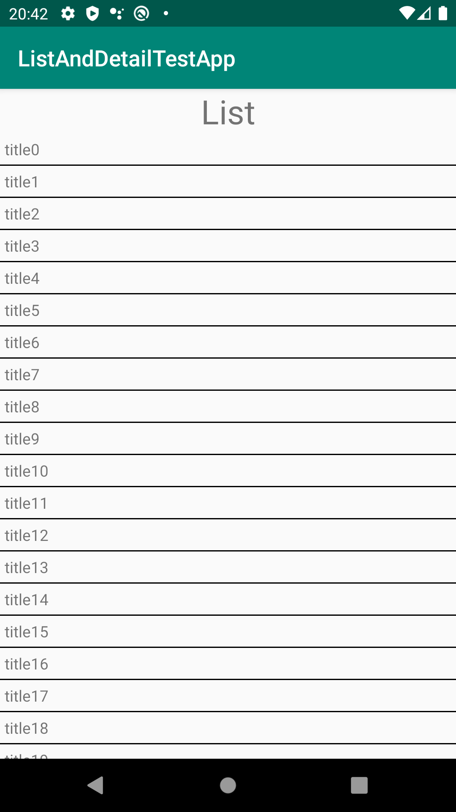
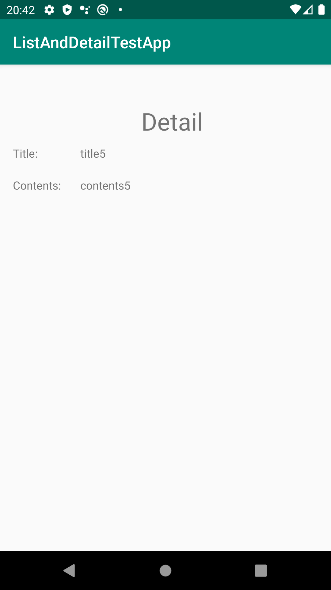

# なにこれ？
一覧-詳細画面のあるAndroidアプリ（一覧のタップ範囲せまいwww）

それぞれの画面はFragmentではなくActivityで作成する。

ViewModelとLiveDataを使いたい。（よくわからないけど..）

# ブランチごとの実装方針
- master：適当に作る(ViewModelとLiveDataなし)
- feature/mvvm：masterをもとにMVVM変更
- feature/mvpvm：feature/mvvmをもとにMVPVMに変更

# 参考にしたもの
Android, 「architecture-samples」:[(https://github.com/android/architecture-samples)](https://github.com/android/architecture-samples)

Google developpers, 「Android アーキテクチャ コンポーネント」:[(https://developer.android.com/topic/libraries/architecture?hl=ja)](https://developer.android.com/topic/libraries/architecture?hl=ja)
